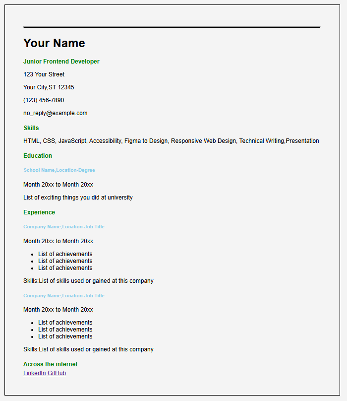

🔗 **Project URL:**  
https://github.com/keerthiD7/singlepagecv
https://keerthid7.github.io/singlepagecv/

# Single Page CV

A clean and professional single-page CV website built using HTML and CSS.  
This project presents resume information in a structured and minimal layout.

---

## 📌 About The Project

This CV website includes:

- Profile Information  
- Skills  
- Education  
- Experience  
- Contact Details  

The design focuses on simplicity, readability, and professional presentation.

---

## 🛠 Technologies Used

- HTML5  
- CSS3  

---

## 📂 Project Structure

singlepagecv/
│
├── index.html
├── style.css
├── singlepagecv.png
└── README.md

---

## ▶️ How to Run

1. Clone the repository  
   git clone https://github.com/keerthiD7/singlepagecv.git  

2. Open `index.html` in your browser  

No additional setup required.

---

